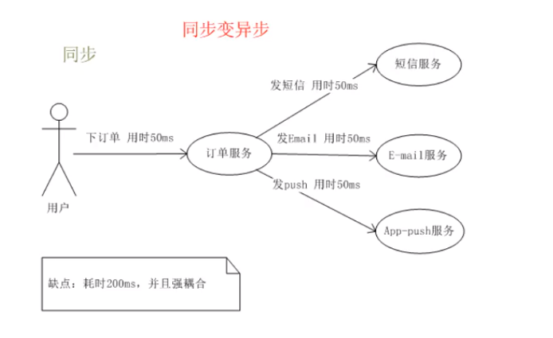
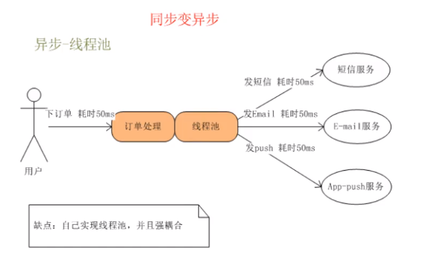
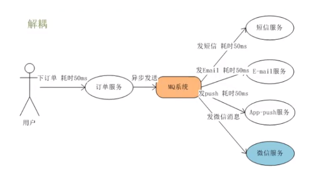

# RabbitMQ

## 一、引入

引入

引入:  服务调用之间的同步太慢:

使用线程池可以将同步转换成异步，但是也有缺点。

使用MQ:

MQ特点: 

* 异步请求: 将消息放到队列，就可以做别的事情，不需要等待返回结果；
* 降低耦合性；
* 缓冲的作用(防止直接压垮消费者)；

## 二、相关基本概念

Message: 由消息头(包括routingKey、priority等)和消息体组成。

producer：消息生产者，就是投递消息的程序。

consumer：消息消费者，就是接受消息的程序。

Broker：简单来说就是消息队列服务器实体。

Exchange：消息交换机，用来接收生产者发送的消息并将这些消息路由给对应的队列，它指定消息按什么规则，路由到哪个队列（三种常用如下）。

* direct (路由)
* fanout(发布与订阅)
* topic(主题，规则匹配)

Queue：消息队列载体，每个消息都会被投入到一个或多个队列。

Binding：绑定，**它的作用就是把exchange和queue按照路由规则绑定起来**。

Routing Key：**路由关键字，exchange根据这个关键字进行消息投递**，也就是决定消息投递到哪个队列的规则，队列通过路由键绑定到交换机，可以理解为匹配的规则。

vhost：虚拟主机，一个broker里可以开设多个vhost，用作不同用户的权限分离。

channel：消息通道(AMQP信道(TCP里面的虚拟连接))，在客户端的每个连接里，可建立多个channel，每个channel代表一个会话任务。

> **由Exchange，Queue，RoutingKey三个才能决定一个从Exchange到Queue的唯一的线路**。

`Advanced Message Queueing Protoco` : 高级消息队列协议。

生产者发送消息的时候，要先指明要发送到哪一个`exchange`上。而且还要指定一个路由`key`。

由于队列和路由`key`也有一个绑定的关系。

> RabbitMQ为什么需要信道(Channel)? 为什么不是TCP直接通信?
>
> * 1、TCP的创建和销毁开销特别大，创建需要3次握手，销毁需要4次挥手；
> * 2、如果不用信道，那应用程序会以TCP连接Rabbit，高峰时每秒成千上万链接造成巨大资源浪费；
> * 3、信道的原理是**一条线程一条通道，多条线程多条通道**，同用一条TCP链接。一条TCP可以容纳无限的信道，即使每秒成千上万的请求也不会成为性能的瓶颈；

## 三、RabbitMQ如何保证消息投递成功

* Step 1： 首先把消息信息(业务数据）存储到数据库中，紧接着，我们再把这个消息记录也存储到一张消息记录表里（或者另外一个同源数据库的消息记录表）

* Step 2：发送消息到MQ Broker节点（采用confirm方式发送，会有异步的返回结果）

* Step 3、4：生产者端接受MQ Broker节点返回的Confirm确认消息结果，然后进行更新消息记录表里的消息状态。比如默认Status = 0 当收到消息确认成功后，更新为1即可！

* Step 5：但是在消息确认这个过程中可能由于网络闪断、MQ Broker端异常等原因导致 回送消息失败或者异常。这个时候就需要发送方（生产者）对消息进行可靠性投递了，保障消息不丢失，100%的投递成功！（有一种极限情况是闪断，Broker返回的成功确认消息，但是生产端由于网络闪断没收到，这个时候重新投递可能会造成消息重复，需要消费端去做幂等处理）所以我们需要有一个定时任务，（比如每5分钟拉取一下处于中间状态的消息，当然这个消息可以设置一个超时时间，比如超过1分钟 Status = 0 ，也就说明了1分钟这个时间窗口内，我们的消息没有被确认，那么会被定时任务拉取出来）

* Step 6：接下来我们把中间状态的消息进行重新投递 retry send，继续发送消息到MQ ，当然也可能有多种原因导致发送失败

* Step 7：我们可以采用设置最大努力尝试次数，比如投递了3次，还是失败，那么我们可以将最终状态设置为Status = 2 ，最后 交由人工解决处理此类问题（或者把消息转储到失败表中）。

 

问题:

 1）信息的发送者和接收者如何维持这个连接，如果一方的连接中断，这期间的数据如何方式丢失？

 2）如何降低发送者和接收者的耦合度？

 3）如何让Priority高的接收者先接到数据？

 4）如何做到load balance？有效均衡接收者的负载？

 5）如何有效的将数据发送到相关的接收者？也就是说将接收者subscribe 不同的数据，如何做有效的filter。

 6）如何做到可扩展，甚至将这个通信模块发到cluster上？

 7）如何保证接收者接收到了完整，正确的数据？