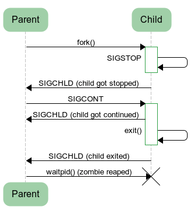

## 14. 进程管理

### 查看进程

#### 1. ps

查看某个时间点的进程信息

示例一：查看自己的进程

```
# ps -l

```

示例二：查看系统所有进程

```
# ps aux

```

示例三：查看特定的进程

```
# ps aux | grep threadx

```

```
-a：显示所有终端机下执行的程序，除了阶段作业领导者之外。
-u<用户识别码>：此选项的效果和指定"-U"选项相同。
x：显示所有程序，不以终端机来区分。

```

#### 2. top

实时显示进程信息

示例：两秒钟刷新一次

```
# top -d 2

```

#### 3. pstree

查看进程树

示例：查看所有进程树

```
# pstree -A

```

#### 4. netstat

查看占用端口的进程

示例：查看特定端口的进程

```
# netstat -anp | grep port
```


参考资料：

- [Linux基础13 进程管理_哔哩哔哩 (゜-゜)つロ 干杯~-bilibili](https://www.bilibili.com/video/av9539203?from=search&seid=12568422774751055363)

<https://www.bilibili.com/video/av9539203?from=search&seid=12568422774751055363>

### 进程状态


| 状态 | 说明                                                         |
| ---- | ------------------------------------------------------------ |
| R    | running or runnable (on run queue)                           |
| D    | uninterruptible sleep (usually I/O)                          |
| S    | interruptible sleep (waiting for an event to complete)       |
| Z    | zombie (terminated but not reaped by its parent) 僵尸进程    |
| T    | stopped (either by a job control signal or because it is being traced) |


#### SIGCHLD

当一个子进程改变了它的状态时：停止运行，继续运行或者退出，有两件事会发生在父进程中：

- 得到 SIGCHLD 信号；
- waitpid() 或者 wait() 调用会返回。



**其中子进程发送的 SIGCHLD 信号包含了子进程的信息，包含了进程 ID、进程状态、进程使用 CPU 的时间等。**

**在子进程退出时，它的进程描述符不会立即释放，这是为了让父进程得到子进程信息**。父进程通过 wait() 和 waitpid() 来获得一个已经退出的子进程的信息。

#### wait()

```c
pid_t wait(int *status)
```

父进程调用 wait() 会一直阻塞，直到收到一个子进程退出的 SIGCHLD 信号，之后 wait() 函数会销毁子进程并返回。

如果成功，返回被收集的子进程的进程 ID；如果调用进程没有子进程，调用就会失败，此时返回 -1，同时 errno 被置为 ECHILD。

参数 status 用来保存被收集的子进程退出时的一些状态，如果我们对这个子进程是如何死掉的毫不在意，只想把这个子进程消灭掉，可以设置这个参数为 NULL：

```
pid = wait(NULL);

```


#### waitpid()

```c
pid_t waitpid(pid_t pid, int *status, int options)
```

作用和 wait() 完全相同，但是多了两个可由用户控制的参数 pid 和 options。

pid 参数指示一个子进程的 ID，表示只关心这个子进程的退出 SIGCHLD 信号。如果 pid=-1 时，那么和 wait() 作用相同，都是关心所有子进程退出的 SIGCHLD 信号。

options 参数主要有 WNOHANG 和 WUNTRACED 两个选项，WNOHANG 可以使 waitpid() 调用变成非阻塞的，也就是说它会立即返回，父进程可以继续执行其它任务。


#### 孤儿进程

一个父进程退出，而它的一个或多个子进程还在运行，那么这些子进程将成为孤儿进程。

孤儿进程将被 init 进程（进程号为 1）所收养，并由 init 进程对它们完成状态收集工作。

由于孤儿进程会被 init 进程收养，所以孤儿进程不会对系统造成危害。


#### 僵尸进程

一个子进程的进程描述符在子进程退出时不会释放，只有当父进程通过 wait() 或 waitpid() 获取了子进程信息后才会释放。如果子进程退出，而父进程并没有调用 wait() 或 waitpid()，那么子进程的进程描述符仍然保存在系统中，这种进程称之为僵尸进程。

僵尸进程通过 ps 命令显示出来的状态为 Z（zombie）。

系统所能使用的进程号是有限的，如果大量的产生僵尸进程，将因为没有可用的进程号而导致系统不能产生新的进程。

要消灭系统中大量的僵尸进程，只需要将其父进程杀死，此时所有的僵尸进程就会变成孤儿进程，从而被 init 所收养，这样 init 就会释放所有的僵死进程所占有的资源，从而结束僵尸进程。


参考资料：

- [孤儿进程与僵尸进程[总结] - Anker's Blog - 博客园](https://www.cnblogs.com/Anker/p/3271773.html)
- [《深入理解计算机系统》异常控制流——读书笔记 - CSDN博客](https://blog.csdn.net/zhanghaodx082/article/details/12280689)
- [Linux系统学习笔记：异常控制流 - CSDN博客](https://blog.csdn.net/yangxuefeng09/article/details/10066357)
- [Linux 之守护进程、僵死进程与孤儿进程 | LiuYongbin](http://liubigbin.github.io/2016/03/11/Linux-%E4%B9%8B%E5%AE%88%E6%8A%A4%E8%BF%9B%E7%A8%8B%E3%80%81%E5%83%B5%E6%AD%BB%E8%BF%9B%E7%A8%8B%E4%B8%8E%E5%AD%A4%E5%84%BF%E8%BF%9B%E7%A8%8B/)
- [CSAPP笔记第八章异常控制流 呕心沥血千行笔记- DDUPzy - 博客园](https://www.cnblogs.com/zy691357966/p/5480537.html)


## 15. 进程和线程的区别

**进程**：CPU资源分配的最小单位

**线程**：CPU调度的最小单位

例子：

开个QQ，开了一个进程；开了迅雷，开了一个进程。 在QQ的这个进程里，传输文字开一个线程、传输语音开了一个线程、弹出对话框又开了一个线程。

所以运行某个软件，相当于开了一个进程。在这个软件运行的过程里（在这个进程里），多个工作支撑的完成QQ的运行，那么这“多个工作”分别有一个线程。

所以一个进程管着多个线程。

通俗的讲：“进程是爹妈，管着众多的线程儿子”...

参考资料：

- [进程与线程的一个简单解释 - 阮一峰的网络日志](http://www.ruanyifeng.com/blog/2013/04/processes_and_threads.html)

## 16. kill用法，某个进程杀不掉的原因（进入内核态，忽略kill信号）

1. 该进程是僵尸进程（STAT z），此时进程已经释放所有的资源，但是没有被父进程释放。僵尸进程要等到父进程结束，或者重启系统才可以被释放。
2. 进程处于“核心态”，并且在等待不可获得的资源，处于“核心态 ”的资源默认忽略所有信号。只能重启系统。

参考资料：

- [linux kill -9 杀不掉的进程 - CSDN博客](https://blog.csdn.net/lemontree1945/article/details/79169178)

### kill

kill命令用来删除执行中的程序或工作。kill可将指定的信息送至程序。预设的信息为`SIGTERM(15)`,可将指定程序终止。若仍无法终止该程序，可使用SIGKILL(9)信息尝试强制删除程序。程序或工作的编号可利用[ps](http://man.linuxde.net/ps)指令或job指令查看。

**语法** 

```
kill(选项)(参数)

```

**选项** 

```
-a：当处理当前进程时，不限制命令名和进程号的对应关系；
-l <信息编号>：若不加<信息编号>选项，则-l参数会列出全部的信息名称；
-p：指定kill 命令只打印相关进程的进程号，而不发送任何信号；
-s <信息名称或编号>：指定要送出的信息；
-u：指定用户。

```

**参数** 

进程或作业识别号：指定要删除的进程或作业。

**实例** 

列出所有信号名称：

```
 kill -l
 1) SIGHUP       2) SIGINT       3) SIGQUIT      4) SIGILL
 5) SIGTRAP      6) SIGABRT      7) SIGBUS       8) SIGFPE
 9) SIGKILL     10) SIGUSR1     11) SIGSEGV     12) SIGUSR2
13) SIGPIPE     14) SIGALRM     15) SIGTERM     16) SIGSTKFLT
17) SIGCHLD     18) SIGCONT     19) SIGSTOP     20) SIGTSTP
21) SIGTTIN     22) SIGTTOU     23) SIGURG      24) SIGXCPU
25) SIGXFSZ     26) SIGVTALRM   27) SIGPROF     28) SIGWINCH
29) SIGIO       30) SIGPWR      31) SIGSYS      34) SIGRTMIN
35) SIGRTMIN+1  36) SIGRTMIN+2  37) SIGRTMIN+3  38) SIGRTMIN+4
39) SIGRTMIN+5  40) SIGRTMIN+6  41) SIGRTMIN+7  42) SIGRTMIN+8
43) SIGRTMIN+9  44) SIGRTMIN+10 45) SIGRTMIN+11 46) SIGRTMIN+12
47) SIGRTMIN+13 48) SIGRTMIN+14 49) SIGRTMIN+15 50) SIGRTMAX-14
51) SIGRTMAX-13 52) SIGRTMAX-12 53) SIGRTMAX-11 54) SIGRTMAX-10
55) SIGRTMAX-9  56) SIGRTMAX-8  57) SIGRTMAX-7  58) SIGRTMAX-6
59) SIGRTMAX-5  60) SIGRTMAX-4  61) SIGRTMAX-3  62) SIGRTMAX-2
63) SIGRTMAX-1  64) SIGRTMAX

```

只有第9种信号(SIGKILL)才可以无条件终止进程，其他信号进程都有权利忽略，**下面是常用的信号：**

```
HUP     1    终端断线
INT     2    中断（同 Ctrl + C）
QUIT    3    退出（同 Ctrl + \）
TERM   15    终止
KILL    9    强制终止
CONT   18    继续（与STOP相反， fg/bg命令）
STOP   19    暂停（同 Ctrl + Z）

```

先用ps查找进程，然后用kill杀掉：

```
ps -ef | grep vim
root      3268  2884  0 16:21 pts/1    00:00:00 vim install.log
root      3370  2822  0 16:21 pts/0    00:00:00 grep vim

kill 3268
kill 3268
-bash: kill: (3268) - 没有那个进程

```

### kill all

**killall命令使用进程的名称来杀死进程**，使用此指令可以杀死一组同名进程。我们可以使用[kill](http://man.linuxde.net/kill)命令杀死指定进程PID的进程，如果要找到我们需要杀死的进程，我们还需要在之前使用[ps](http://man.linuxde.net/ps)等命令再配合[grep](http://man.linuxde.net/grep)来查找进程，而killall把这两个过程合二为一，是一个很好用的命令。

**语法** 

```
killall(选项)(参数)

```

选项 

```
-e：对长名称进行精确匹配；
-l：忽略大小写的不同；
-p：杀死进程所属的进程组；
-i：交互式杀死进程，杀死进程前需要进行确认；
-l：打印所有已知信号列表；
-q：如果没有进程被杀死。则不输出任何信息；
-r：使用正规表达式匹配要杀死的进程名称；
-s：用指定的进程号代替默认信号“SIGTERM”；
-u：杀死指定用户的进程。

```

**参数** 

进程名称：指定要杀死的进程名称。

**实例** 

杀死所有同名进程

```
killall vi

```

