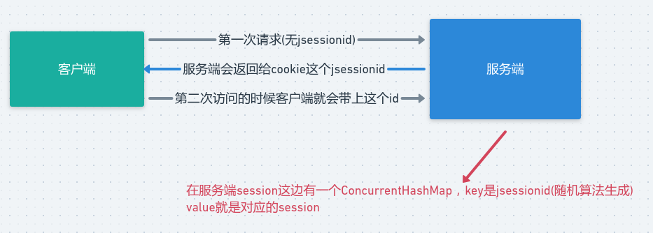

## 一、TCP、UDP协议的区别

**UDP 在传送数据之前不需要先建立连接**，远地主机在收到 UDP 报文后，**不需要给出任何确认**。

虽然 UDP 不提供可靠交付，但在某些情况下 UDP 确是一种最有效的工作方式（一般用于即时通信），比如： QQ 语音、 QQ 视频 、直播等等。

TCP 提供面向连接的服务。**在传送数据之前必须先建立连接，数据传送结束后要释放连接**。

TCP 不提供广播或多播服务。由于 TCP 要提供可靠的，面向连接的运输服务（TCP的可靠体现在TCP在传递数据之前，会有三次握手来建立连接，而且在数据传递时，有**确认、窗口、重传、拥塞控制机制**，在数据传完后，还会断开连接用来节约系统资源），这一难以避免增加了许多开销，如确认，流量控制，计时器以及连接管理等。

这不仅使协议数据单元的首部增大很多，还要占用许多处理机资源。TCP 一般用于文件传输、发送和接收邮件、远程登录等场景。


## 二、从输入网址到获得页面的网络请求过程

简单版: 

* **查询DNS（域名解析），获取域名对应的IP地址**；
* **浏览器获得域名对应的IP地址后，浏览器与服务器建立tcp连接（三次握手）**；
* **TCP/IP连接建立起来后，浏览器就可以向服务器发送HTTP请求了**。**（请求和传输数据）**
* **服务器接受到这个请求后，根据路径参数，经过后端的一些处理生成html页面代码返回给浏览器**；(处理请求并返回HTTP报文)
* **浏览器拿到完整的html页面代码开始解析和渲染，如果遇到引用的外部css、图片等静态资源，他们同样也是一个个htpp请求，重复上面的步骤**。
* **浏览器根据拿到的资源对页面进行渲染，最终把一个完整的页面呈现给用户**。

复杂版:

- 查询 DNS

  - 浏览器搜索**自身的DNS缓存**，操作系统的DNS缓存，本地host文件查询
  - 如果 **DNS 服务器和我们的主机在同一个子网内**，系统会按照下面的 ARP 过程对 DNS 服务器进行 ARP查询
  - 如果 DNS 服务器和我们的主机在不同的子网，系统会按照下面的 ARP 过程对默认网关进行查询

- **浏览器获得域名对应的IP地址后，发起HTTP三次握手**。

- **TCP/IP连接建立起来后，浏览器就可以向服务器发送HTTP请求了**。

- TLS 握手

  - 客户端发送一个 `ClientHello` 消息到服务器端，消息中同时包含了它的 Transport Layer Security (TLS) 版本，可用的加密算法和压缩算法。
  - 服务器端向客户端返回一个 `ServerHello` 消息，消息中包含了服务器端的TLS版本，服务器所选择的加密和压缩算法，以及数字证书认证机构（Certificate Authority，缩写 CA）签发的服务器公开证书，证书中包含了公钥。客户端会使用这个公钥加密接下来的握手过程，直到协商生成一个新的对称密钥
  - 客户端根据自己的信任CA列表，验证服务器端的证书是否可信。如果认为可信，客户端会生成一串伪随机数，使用服务器的公钥加密它。这串随机数会被用于生成新的对称密钥
  - 服务器端使用自己的私钥解密上面提到的随机数，然后使用这串随机数生成自己的对称主密钥
  - 客户端发送一个 `Finished` 消息给服务器端，使用对称密钥加密这次通讯的一个散列值
  - 服务器端生成自己的 hash 值，然后解密客户端发送来的信息，检查这两个值是否对应。如果对应，就向客户端发送一个 `Finished` 消息，也使用协商好的对称密钥加密
  - 从现在开始，接下来整个 TLS 会话都使用对称秘钥进行加密，传输应用层（HTTP）内容

- HTTP 服务器请求处理

  HTTPD(HTTP Daemon)在服务器端处理请求/响应。最常见的 HTTPD 有 Linux 上常用的 Apache 和 nginx，以及 Windows 上的 IIS。

  - HTTPD 接收请求

  - - 服务器把请求拆分为以下几个参数：

      HTTP 请求方法(`GET`, `POST`, `HEAD`, `PUT`, `DELETE`, `CONNECT`, `OPTIONS`, 或者 `TRACE`)。直接在地址栏中输入 URL 这种情况下，使用的是 GET 方法域名：google.com请求路径/页面：/ (我们没有请求google.com下的指定的页面，因此 / 是默认的路径)

  - 服务器验证其上已经配置了 google.com 的虚拟主机

  - 服务器验证 google.com 接受 GET 方法

  - 服务器验证该用户可以使用 GET 方法(根据 IP 地址，身份信息等)

  - 如果服务器安装了 URL 重写模块（例如 Apache 的 mod_rewrite 和 IIS 的 URL Rewrite），服务器会尝试匹配重写规则，如果匹配上的话，服务器会按照规则重写这个请求

  - 服务器根据请求信息获取相应的响应内容，这种情况下由于访问路径是 "/" ,会访问首页文件（你可以重写这个规则，但是这个是最常用的）。

  - 服务器会使用指定的处理程序分析处理这个文件，假如 Google 使用 PHP，服务器会使用 PHP 解析 index 文件，并捕获输出，把 PHP 的输出结果返回给请求者

- 服务器接受到这个请求，根据路径参数，经过后端的一些处理生成HTML页面代码返回给浏览器

- 浏览器拿到完整的HTML页面代码开始解析和渲染，如果遇到引用的外部[js](http://lib.csdn.net/base/javascript)，CSS,图片等静态资源，它们同样也是一个个的HTTP请求，都需要经过上面的步骤

- 浏览器根据拿到的资源对页面进行渲染，最终把一个完整的页面呈现给用户

## 三、GET和POST区别

- GET 被强制服务器支持
- 浏览器对URL的长度有限制，所以GET请求不能代替POST请求发送大量数据
- **GET请求发送数据更小**
- **GET请求是不安全的**
- GET请求是幂等的
  - 幂等的意味着对同一URL的多个请求应该返回同样的结果
- **POST请求不能被缓存**
- **POST请求相对GET请求是「安全」的**
  - 这里安全的含义仅仅是指是非修改信息
- GET用于信息获取，而且是安全的和幂等的
  - 所谓安全的意味着该操作用于获取信息而非修改信息。换句话说，GET 请求一般不应产生副作用。就是说，它仅仅是获取资源信息，就像数据库查询一样，不会修改，增加数据，不会影响资源的状态。
- **POST是用于修改服务器上的资源的请求**
- **发送包含未知字符的用户输入时，POST 比 GET 更稳定也更可靠**
- **GET 参数通过 URL 传递，并且长度有限制，而 POST 放在 request body 并且长度没有限制**。并且，正因为这个原因， GET 比 POST 更不安全，因为参数暴露在 URL 中。
- GET 产生一个 TCP 数据包，而 POST 产生两个 TCP 数据包。

**引申：说完原理性的问题，我们从表面上来看看GET和POST的区别：**

- **GET是从服务器上获取数据，POST是向服务器传送数据**。 GET和 POST只是一种传递数据的方式，GET也可以把数据传到服务器，他们的本质都是发送请求和接收结果。只是组织格式和数据量上面有差别，http协议里面有介绍
- GET是把参数数据队列加到提交表单的ACTION属性所指的URL中，值和表单内各个字段一一对应，在URL中可以看到。POST是通过HTTP POST机制，将表单内各个字段与其内容放置在HTML HEADER内一起传送到ACTION属性所指的URL地址。用户看不到这个过程。 **因为GET设计成传输小数据，而且最好是不修改服务器的数据，所以浏览器一般都在地址栏里面可以看到，但POST一般都用来传递大数据，或比较隐私的数据，所以在地址栏看不到**，能不能看到不是协议规定，是浏览器规定的。
- 对于GET方式，服务器端用Request.QueryString获取变量的值，对于POST方式，服务器端用Request.Form获取提交的数据。 没明白，怎么获得变量和你的服务器有关，和GET或POST无关，服务器都对这些请求做了封装
- GET传送的数据量较小，不能大于2KB。POST传送的数据量较大，一般被默认为不受限制。但理论上，IIS4中最大量为80KB，IIS5中为100KB。 POST基本没有限制，我想大家都上传过文件，都是用POST方式的。只不过要修改form里面的那个type参数
- GET安全性非常低，POST安全性较高。 如果没有加密，他们安全级别都是一样的，随便一个监听器都可以把所有的数据监听到。

## 四、HTTPS和HTTP区别

- http是HTTP协议运行在TCP之上。所有传输的内容都是明文，客户端和服务器端都无法验证对方的身份。
- https是HTTP运行在SSL/TLS之上，SSL/TLS运行在TCP之上。**所有传输的内容都经过加密，加密采用对称加密，但对称加密的密钥用服务器方的证书进行了非对称加密**。此外客户端可以验证服务器端的身份，如果配置了客户端验证，服务器方也可以验证客户端的身份。
- https协议需要到ca申请证书，一般免费证书很少，需要交费。
- **http是超文本传输协议，信息是明文传输，https 则是具有安全性的ssl加密传输协议**
- **http和https使用的是完全不同的连接方式用的端口也不一样,前者是80,后者是443**。
- http的连接很简单,是无状态的
- HTTPS协议是由SSL+HTTP协议构建的可进行加密传输、身份认证的网络协议 要比http协议安全。

## 五、如果已经建立了连接，但是客户端突然出现故障了怎么办？

TCP还设有一个保活计时器，显然，客户端如果出现故障，服务器不能一直等下去，白白浪费资源。

**服务器每收到一次客户端的请求后都会重新复位这个计时器**，时间通常是设置为2小时，若两小时还没有收到客户端的任何数据，服务器就会发送一个**探测报文段**，以后每隔75分钟发送一次。若一连发送10个探测报文仍然没反应，服务器就认为客户端出了故障，接着就关闭连接。

### 六、Cookie和Session

cookie的内容主要包括：名字，值，过期时间，路径和域。路径与域一起构成cookie的作用范围。若不设置过期时间，则表示这个cookie的生命期为浏览器会话期间，关闭浏览器窗口，cookie就消失。这种生命期为浏览器会话期的cookie被称为会话cookie。会话cookie一般不存储在硬盘上而是保存在内存里，当然这种行为并不是规范规定的。若设置了过期时间，浏览器就会把cookie保存到硬盘上，关闭后再次打开浏览器，这些cookie仍然有效直到超过设定的过期时间。存储在硬盘上的cookie可以在不同的浏览器进程间共享，比如两个IE窗口。而对于保存在内存里的cookie，不同的浏览器有不同的处理方式

session机制。session机制是一种服务器端的机制，服务器使用一种类似于散列表(`ConcurrentHashMap`)的结构来保存信息。当程序需要为某个客户端的请求创建一个session时，服务器首先检查这个客户端的请求里是否已包含了一个session标识（称为session id），如果已包含则说明以前已经为此客户端创建过session，服务器就按照session id把这个session检索出来使用。如果客户端请求不包含session id，则为此客户端创建一个session并且生成一个与此session相关联的session id，session id的值应该是一个既不会重复，又不容易被找到规律以仿造的字符串，**这个session id将被在本次响应中返回给客户端保存**。**保存这个session id的方式可以采用cookie，这样在交互过程中浏览器可以自动的按照规则把这个标识发送给服务器**。一般这个cookie的名字都是类似于SEEESIONID。但cookie可以被人为的禁止，则必须有其他机制以便在cookie被禁止时仍然能够把session id传递回服务器。



**cookie 和session 的区别：**

**1、cookie数据存放在客户的浏览器上，session数据放在服务器上。**

**2、cookie不是很安全，别人可以分析存放在本地的COOKIE并进行COOKIE欺骗**
   考虑到安全应当使用session。

**3、session会在一定时间内保存在服务器上。当访问增多，会比较占用你服务器的性能**
   考虑到减轻服务器性能方面，应当使用COOKIE。

**4、单个cookie保存的数据不能超过4K，很多浏览器都限制一个站点最多保存20个cookie。**

**5、所以个人建议：**
   将登陆信息等重要信息存放为SESSION
   **其他信息如果需要保留，可以放在COOKIE中**


## HTTP1.0和 HTTP1.1的区别

HTTP1.0默认短连接，可以长连接，但是需要设置header connection：keep_Alive
HTTP1.1默认长连接

### HTTP1.0， HTTP1.1和 HTTP2.0的区别

HTTP2.0支持二进制传输数据，更加安全快捷，而 HTTP1.0， HTTP1.1支持文本
HTTP2.0实现多路复用，更加快捷
HTTP2.0压缩header
HTTP2.0支持服务“主动”给客户端缓存发送数据

## 什么是长连接、短连接？

在HTTP/1.0中默认使用短连接。也就是说，客户端和服务器每进行一次HTTP操作，就建立一次连接，任务结束就中断连接。当客户端浏览器访问的某个HTML或其他类型的Web页中包含有其他的Web资源（如JavaScript文件、图像文件、CSS文件等），每遇到这样一个Web资源，浏览器就会重新建立一个HTTP会话。

而从HTTP/1.1起，默认使用长连接，用以保持连接特性。使用长连接的HTTP协议，会在响应头加入这行代码：

```java
Connection:keep-alive
```

在使用长连接的情况下，当一个网页打开完成后，客户端和服务器之间用于传输HTTP数据的TCP连接不会关闭，客户端再次访问这个服务器时，会继续使用这一条已经建立的连接。Keep-Alive不会永久保持连接，它有一个保持时间，可以在不同的服务器软件（如Apache）中设定这个时间。实现长连接需要客户端和服务端都支持长连接。

HTTP协议的长连接和短连接，实质上是TCP协议的长连接和短连接。

### Servlet 的生存周期

• Servlet 接口定义了 5 个方法，其中前三个方法与 Servlet 生命周期相关： 
○ -void init(ServletConfig config) throws ServletException
○ void service(ServletRequest req, ServletResponse resp) throws ServletException, java.io.IOException
○ void destory()
○ java.lang.String getServletInfo()
○ ServletConfig getServletConfig()
• Web 容器加载 Servlet 并将其实例化后， Servlet 生命周期开始，容器运行其 init() 方法进行 Servlet 的初始化；请求到达时调用
Servlet 的 service() 方法， service() 方法会根据需要调用与请求对应的 doGet 或 doPost 等方法；当服务器关闭或项目被卸载时
服务器会将 Servlet 实例销毁，此时会调用 Servlet 的 destroy() 方法。

### Jsp 和 Servlet 的区别

• Servlet 是一个特殊的 Java 程序，它运行于服务器的 JVM 中，能够依靠服务器的支持向浏览器提供显示内容。 JSP 本质上是
Servlet 的一种简易形式， JSP 会被服务器处理成一个类似于 Servlet 的 Java 程序，可以简化页面内容的生成。 Servlet 和 JSP 最
主要的不同点在于， Servlet 的应用逻辑是在 Java 文件中，并且完全从表示层中的 HTML 分离开来。而 JSP 的情况是 Java 和
HTML 可以组合成一个扩展名为 .
jsp 的文件。有人说， Servlet 就是在 Java 中写 HTML ，而 JSP 就是在 HTML 中写 Java 代码，当
然这个说法是很片面且不够准确的。 JSP 侧重于视图， Servlet 更侧重于控制逻辑，在 MVC 架构模式中， JSP 适合充当视图
（ view ）而 Servlet 适合充当控制器

### 保存会话状态，有哪些方式、区别如何

• 由于 HTTP 协议本身是无状态的，服务器为了区分不同的用户，就需要对用户会话进行跟踪，简单的说就是为用户进行登记，
为用户分配唯一的 ID ，下一次用户在请求中包含此 ID ，服务器据此判断到底是哪一个用户。 
○ ① URL 重写：在 URL 中添加用户会话的信息作为请求的参数，或者将唯一的会话 ID 添加到 URL 结尾以标识一个会话。 
○ ② 设置表单隐藏域：将和会话跟踪相关的字段添加到隐式表单域中，这些信息不会在浏览器中显示但是提交表单时会提
交给服务器。 
这两种方式很难处理跨越多个页面的信息传递，因为如果每次都要修改 URL 或在页面中添加隐式表单域来存储用户会话相关
信息，事情将变得非常麻烦。 
○ ③ ** 补充： **HTML5 中可以使用 Web Storage 技术通过 JavaScript 来保存数据，例如可以使用 localStorage 和
sessionStorage 来保存用户会话的信息，也能够实现会话跟踪。

## 七、HTTP状态

服务器返回的 **响应报文** 中第一行为状态行，包含了状态码以及原因短语，用来告知客户端请求的结果。

| 状态码 | 类别                             | 原因短语                   |
| ------ | -------------------------------- | -------------------------- |
| 1XX    | Informational（信息性状态码）    | 接收的请求正在处理         |
| 2XX    | Success（成功状态码）            | 请求正常处理完毕           |
| 3XX    | Redirection（重定向状态码）      | 需要进行附加操作以完成请求 |
| 4XX    | Client Error（客户端错误状态码） | 服务器无法处理请求         |
| 5XX    | Server Error（服务器错误状态码） | 服务器处理请求出错         |

### （1）1XX 信息

- **100 Continue** ：表明到目前为止都很正常，客户端可以继续发送请求或者忽略这个响应。

### （2）2XX 成功

- **200 OK**
- **204 No Content** ：请求已经成功处理，但是返回的响应报文不包含实体的主体部分。一般在只需要从客户端往服务器发送信息，而不需要返回数据时使用。
- **206 Partial Content** ：表示客户端进行了范围请求。响应报文包含由 Content-Range 指定范围的实体内容。

### （3）3XX 重定向

- **301 Moved Permanently** ：永久性重定向
- **302 Found** ：临时性重定向
- **303 See Other** ：和 302 有着相同的功能，但是 303 明确要求客户端应该采用 GET 方法获取资源。
- 注：虽然 HTTP 协议规定 301、302 状态下重定向时不允许把 POST 方法改成 GET 方法，但是大多数浏览器都会在 301、302 和 303 状态下的重定向把 POST 方法改成 GET 方法。
- **304 Not Modified** ：如果请求报文首部包含一些条件，例如：If-Match，If-Modified-Since，If-None-Match，If-Range，If-Unmodified-Since，如果不满足条件，则服务器会返回 304 状态码。
- **307 Temporary Redirect** ：临时重定向，与 302 的含义类似，但是 307 要求浏览器不会把重定向请求的 POST 方法改成 GET 方法。

### （4）4XX 客户端错误

- **400 Bad Request** ：请求报文中存在语法错误。
- **401 Unauthorized** ：该状态码表示发送的请求需要有认证信息（BASIC 认证、DIGEST 认证）。如果之前已进行过一次请求，则表示用户认证失败。
- **403 Forbidden** ：请求被拒绝，服务器端没有必要给出拒绝的详细理由。
- **404 Not Found**

### （5）5XX 服务器错误

- **500 Internal Server Error** ：服务器正在执行请求时发生错误。
- **503 Service Unavailable** ：服务器暂时处于超负载或正在进行停机维护，现在无法处理请求。

## 4. HTTP方法

客户端发送的 **请求报文** 第一行为请求行，包含了方法字段。

### （1）GET

> 获取资源

当前网络请求中，绝大部分使用的是 GET 方法。

### （2）HEAD

> 获取报文首部

和 GET 方法一样，但是不返回报文实体主体部分。

主要用于确认 URL 的有效性以及资源更新的日期时间等。

### （3）POST

> 传输实体主体

POST 主要用来传输数据，而 GET 主要用来获取资源。

更多 POST 与 GET 的比较请见第八章。

### （4）PUT

> 上传文件

由于自身不带验证机制，任何人都可以上传文件，因此存在安全性问题，一般不使用该方法。

```
PUT /new.html HTTP/1.1
Host: example.com
Content-type: text/html
Content-length: 16

<p>New File</p>
```

### （5）PATCH

> 对资源进行部分修改

PUT 也可以用于修改资源，但是只能完全替代原始资源，PATCH 允许部分修改。

```
PATCH /file.txt HTTP/1.1
Host: www.example.com
Content-Type: application/example
If-Match: "e0023aa4e"
Content-Length: 100

[description of changes]
```

### （6）DELETE

> 删除文件

与 PUT 功能相反，并且同样不带验证机制。

```
DELETE /file.html HTTP/1.1
```

### （7）OPTIONS

> 查询支持的方法

查询指定的 URL 能够支持的方法。

会返回 Allow: GET, POST, HEAD, OPTIONS 这样的内容。

### （8）CONNECT

> 要求在与代理服务器通信时建立隧道

使用 SSL（Secure Sockets Layer，安全套接层）和 TLS（Transport Layer Security，传输层安全）协议把通信内容加密后经网络隧道传输。